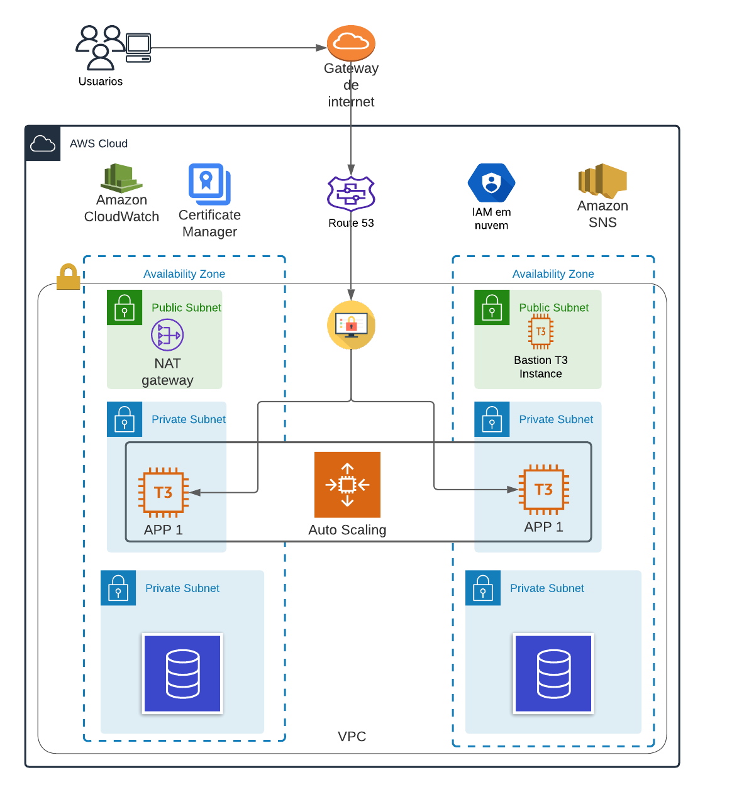

## [DevOps] 01 - Projeto de exemplo com Terraform

## Visão geral

- Este laboratório faz parte de uma série de laboratórios DevOps com projetos de amostra completa.

- Tudo que você tem que fazer é seguir passo a passo para completá-lo.

- Este laboratório pode custar algum dinheiro, mas não muito se você mantê-lo funcionando por um curto período de tempo.

## O que você vai aprender neste laboratório

- Use o Terraform para configurar a infraestrutura na AWS.

- A infraestrutura inclui VPC, NAT gateway, security group, Auto Scaling group, EC2, ALB, Elastic IP, and Certificate Manager (SSL/TLS certificates).

- Observe que esta é uma arquitetura de rede VPC de 3 níveis. 

- Contamos com o módulo Terraform "terraform-aws-modules/vpc/aws" para criar a maioria dos componentes de rede aqui.

## Diagrama de arquitetura

Aqui está o que você vai criar neste laboratório!



## Pré-requisitos

- [Instalar o Terraform](https://learn.hashicorp.com/tutorials/terraform/install-cli)
- [Instalar o AWS CLI](https://docs.aws.amazon.com/pt_br/cli/latest/userguide/getting-started-install.html)
- [Configurar o AWS CLI](https://docs.aws.amazon.com/pt_br/cli/latest/userguide/cli-chap-configure.html)

## Instalar visual Studio Code:

https://code.visualstudio.com/download

## Prepare a conta e o usuário da AWS

- Você precisa de uma conta AWS e um usuário IAM. Se você não tem uma conta AWS, inscreva-se, mas certifique-se de ter um cartão de pagamento internacional.

- Para ambientes de laboratório, um usuário do IAM com a política gerenciada "AdministratorAccess" está bem. 

## Registre um domínio

- Este laboratório requer um domínio para configurar HTTPS! Melhor ter algum tipo de domínio de teste usado para fins de laboratório.

- O domínio pode ser registrado em qualquer registrador de domínio ou direto na mesma conta AWS, dependendo de suas necessidades. 
  Possuir um nome de domínio normalmente custará entre US$ 10 e US$ 20 por ano.

- Você também precisa criar uma zona hospedada no Route53 para o domínio acima na mesma conta AWS e obter as informações de registro do NS a partir daí.


- Em seguida, vá para as configurações do seu domínio e atualize seus servidores de nome para direcionar o tráfego para o Route53 da sua conta AWS.


## Armazenamento de estado remoto com S3 e DynamoDB

- NOTA: Se você optar por não usar o estado remoto para uma abordagem mais simples, você pode pular esta etapa, mas certifique-se de comentar o conteúdo do arquivo "t1-02-backend.tf" mais tarde.

- O estado terraform (arquivo "terraform.tfstate") também pode ser armazenado remotamente. Neste laboratório, você precisa criar um Bucket S3 com antecedência para armazenar o arquivo estatal da seguinte forma:

```sh
Bucket name: devops-projects-infra-test
Region: US-East (N.Virginia) us-east-1
Bucket Versioning: Enable
Create folder: dev/devops-01
```

- Em seguida, crie uma tabela Dínamo DB que é usada para bloqueio de estado:

```sh
Table Name: dev-devops-01
Partition key (Primary Key): LockID (Type as String)
```

## Confira o código-fonte

- Aqui está o código fonte para conferir:

```sh
$ cd sua-pasta/do/seu/pc
$ git clone https://github.com/efcunha/devops-labs.git
$ cd 01-terraform-aws-3tier/terraform/
```

- Porque você terá um domínio de teste diferente, então você precisará modificar algum código para se adequar ao seu ambiente:

```sh
# File t06-02-datasource-route53-zone.tf
  name   = "your-domain.com"

# File t11-acm-certificatemanager.tf
  *.your-domain.com" # change this!

# File t12-route53-dnsregistration.tf
  name    = "devops01.your-domain.com" # change this!

# File t13-05-autoscaling-notifications.tf
  endpoint  = "someone@domain.com" # change this! (to your email)

# File my-canary/nodejs/node_modules/my-canary.js
  const urls = ['https://devops01.your-domain.com']; // change this!
```

- Depois de mudar meu canary.js, você precisa re-executar o seguinte comando:

```sh
cd my-canary
zip -r my-canaryv1.zip nodejs
```

- Em seguida, você precisa criar um par-chave chamado "terraform-key" em sua conta AWS (usado para fazer login na sua instância EC2 mais tarde):

```sh
$ cd private-key/

$ ssh-keygen -f terraform-key.pem

# Go to EC2 -> Key pairs -> Import key pair
# and follow the guide.
# Remember the key pair's name is "terraform-key".
```

## Parabéns! Agora tudo deve estar pronto.

## Executar comandos terraform

- Agora é hora de executar oficialmente os comandos terraform para criar o seu ambiente!
- terraforme o primeiro comando a ser executado a fim de preparar o diretório de trabalho atual. 
- Ele instalará plugins e módulos infantis, inicializará o backend, copiará um módulo de origem, etc.

É seguro executar este comando várias vezes.

```sh
$ terraform init

Terraform has been successfully initialized!
```

## Terraform validate

- Verificará se uma configuração é sintáticamente válida e internamente consistente, independentemente de quaisquer variáveis fornecidas ou estado existente.

- É seguro executar este comando automaticamente, por exemplo, como uma verificação pós-salvamento em um editor de texto ou como um passo de teste para um módulo reutilizável em um sistema DE CI.

```sh
$ terraform validate
Success! The configuration is valid.
```

## Terraform plan

- Ele criará um plano de execução, que permite visualizar as mudanças que a Terraform planeja fazer à sua infraestrutura.

- O comando do plano por si só não realizará as alterações propostas, então você pode usar este comando para verificar se as mudanças propostas correspondem ao que você esperava.

## Terraform apply

- Executará as ações propostas em um plano Terraform.

- No caso padrão, sem nenhum arquivo de plano salvo, a terraform aplica cria seu próprio plano de ação, da mesma forma que o "plano terraform" faria.

```sh
$ terraform apply

Do you want to perform these actions?
  Terraform will perform the actions described above.
  Only 'yes' will be accepted to approve.

Enter a value: yes

Apply complete! Resources: 96 added, 0 changed, 0 destroyed.
Outputs:
```

## Explorar e confirmar os recursos da AWS

- Verifique seu e-mail para a assinatura do SNS
- Instâncias EC2 (1 bastião e 2 servidores web)
- Auto Scaling Groups (and Launch template)
- Load Balancers
- Target Groups (and Health checks)
- CloudWatch
  ALB Alarm, ASG Alarm, CIS Alarms, Synthetics

- Acesse o domínio do serviço:

https://devops01.your-domain.com/
https://devops01.your-domain.com/app1/
https://devops01.your-domain.com/app1/metadata.html

- Baixe o arquivo de estado remoto, se necessário:

```sh
$ terraform state pull
```

# Faça login na instância Bastião:

```sh
$ ssh -i private-key/terraform-key.pem ec2-user@BastionHost-Public IPv4
```

## Limpar Instalação

- Destruir todos os objetos remotos gerenciados por uma configuração terraform.

```sh
$ terraform destroy

Acquiring state lock. This may take a few moments...

Do you really want to destroy all resources?
  Terraform will destroy all your managed infrastructure, as shown above.
  There is no undo. Only 'yes' will be accepted to confirm.

Enter a value: yes

Releasing state lock. This may take a few moments...
Destroy complete! Resources: 98 destroyed.
```

## Alguns recursos AWS que você tem que excluir manualmente:

```sh
CloudWatch > Log groups
CloudWatch > Alarms
Lambda > Functions
S3 bucket, DynamoDB
```

- e também os seguintes arquivos locais:

## Delete Files

```sh
rm -rf .terraform*
rm -rf terraform.tfstate*
```

## Conclusão

Parabéns por completar o laboratório. Não é fácil entender do que se trata, mas passando por todos os passos você aprendeu muito.
